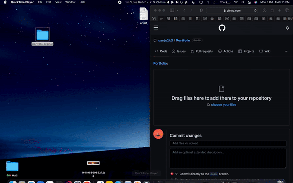

<h2 align="center">
  Portfolio Website  
  <a href="http://sanjay-portfolio.tech/" target="_blank">sanjay-portfolio.tech</a>
</h2>

  

 

 &nbsp;
 &nbsp;
 &nbsp;
](https://forthebadge.com) &nbsp;
](https://forthebadge.com)

## Built With

My personal portfolio <a href="http://sanjay-portfolio.tech/" target="_blank">sanjay.tech</a> which features some of my github projects as well as my resume and technical skills. 

This project was built using these technologies.

- React.js
- Node.js
- Express.js
- CSS3
- VsCode
- Vercel

## Features

**📖 Multi-Page Layout**

**🎨 Styled with React-Bootstrap and Css with easy to customize colors**

**📱 Fully Responsive**

### Show your support

Give a ⭐ if you like this website!

